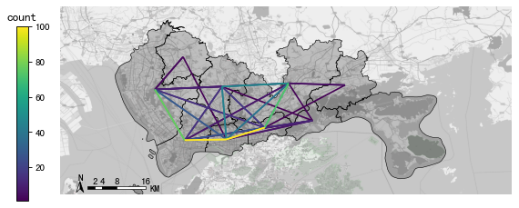
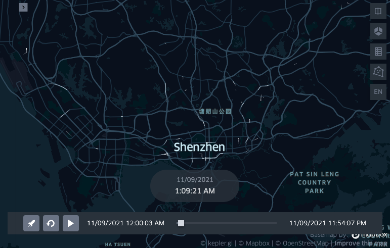

出租车数据处理
==============

| 这个案例的Jupyter notebook: `点击这里 <https://github.com/ni1o1/transbigdata/blob/main/example/Example%201-Taxi%20GPS%20data%20processing.ipynb>`__.
| 可以点击 `这个链接 <https://mybinder.org/v2/gh/ni1o1/transbigdata/d7d6fa33ff16440ba1698b10dd3cf3f76ff00abd?urlpath=lab%2Ftree%2Fexample%2FExample%201-Taxi%20GPS%20data%20processing.ipynb>`__ 在线编辑器中尝试
| 使用示例中的样例数据集在github仓库中，链接为：https://github.com/ni1o1/transbigdata/tree/main/example
| 下面我们介绍如何使用TransBigData包，调用其中的函数实现对出租车GPS数据的快速处理。
| 首先我们引入TransBigData包，并读取数据:

::

    import transbigdata as tbd
    import pandas as pd
    import geopandas as gpd
    #读取数据    
    data = pd.read_csv('../example/data/TaxiData-Sample.csv',header = None) 
    data.columns = ['VehicleNum','time','lon','lat','OpenStatus','Speed'] 
    data

::

    #读取区域信息
    import geopandas as gpd
    sz = gpd.read_file(r'../example/data/sz.json')
    sz.crs = None
    @savefig taxi-sz.png width=4in
    sz.plot()

数据预处理
----------------

TransBigData包也集成了数据预处理的常用方法。其中， :func:`transbigdata.clean_outofshape` 方法输入数据和研究范围区域信息，筛选剔除研究范围外的数据。而 :func:`transbigdata.clean_taxi_status` 方法则可以剔除的载客状态瞬间变化的记录。在使用预处理的方法时，需要传入相应的列，代码如下：

::

    #数据预处理
    #剔除研究范围外的数据
    data = tbd.clean_outofshape(data, sz, col=['lon', 'lat'], accuracy=500)
    #剔除出租车数据中载客状态瞬间变化的记录
    data = tbd.clean_taxi_status(data, col=['VehicleNum', 'time', 'OpenStatus'])

数据栅格化
----------------------------

以栅格形式表达数据分布是最基本的表达方法。GPS数据经过栅格化后，每个数据点都含有对应的栅格信息，采用栅格表达数据的分布时，其表示的分布情况与真实情况接近。如果要使用TransBigData工具进行栅格划分，首先需要确定栅格化的参数（可以理解为定义了一个栅格坐标系），参数可以帮助我们快速进行栅格化:

::

    #栅格化
    #定义范围，获取栅格化参数
    bounds = [113.6,22.4,114.8,22.9]
    params = tbd.area_to_params(bounds,accuracy = 500)
    params

取得栅格化参数后，将GPS对应至栅格，由LONCOL与LATCOL两列共同指定一个栅格:

::

    #将GPS栅格化
    data['LONCOL'],data['LATCOL'] = tbd.GPS_to_grid(data['lon'],data['lat'],params)
    data

统计每个栅格的数据量:

::

    #集计栅格数据量
    datatest = data.groupby(['LONCOL','LATCOL'])['VehicleNum'].count().reset_index()
    datatest

生成栅格的地理图形，并将它转化为GeoDataFrame:

::

    #生成栅格地理图形
    datatest['geometry'] = tbd.grid_to_polygon([datatest['LONCOL'],datatest['LATCOL']],params)
    #转为GeoDataFrame
    import geopandas as gpd
    datatest = gpd.GeoDataFrame(datatest)
    datatest

绘制栅格测试是否成功:

::

    #绘制
    @savefig taxi-datatest.png width=4in
    datatest.plot(column = 'VehicleNum')

出行OD提取与集计
----------------------

使用 :func:`transbigdata.taxigps_to_od` 方法，传入对应的列名，即可提取出行OD:

::

    #从GPS数据提取OD
    oddata = tbd.taxigps_to_od(data,col = ['VehicleNum','time','lon','lat','OpenStatus'])
    oddata

对提取出的OD进行OD的栅格集计,并生成GeoDataFrame

::
    :okwarning:

    #栅格化OD并集计
    od_gdf = tbd.odagg_grid(oddata,params)
    @savefig taxi-od_gdf1.png width=4in
    od_gdf.plot(column = 'count')

出行OD小区集计
--------------------------------

TransBigData包也提供了将OD直接集计到小区的方法

::
    :okwarning:

    #OD集计到小区（在不传入栅格化参数时，直接用经纬度匹配）
    od_gdf = tbd.odagg_shape(oddata,sz,round_accuracy=6)
    @savefig taxi-od_gdf2.png width=4in
    od_gdf.plot(column = 'count')

::
    :okwarning:

    #OD集计到小区（传入栅格化参数时，先栅格化后匹配，可加快匹配速度，数据量大时建议使用）
    od_gdf = tbd.odagg_shape(oddata,sz,params = params)
    @savefig taxi-od_gdf3.png width=4in
    od_gdf.plot(column = 'count')

基于matplotlib的地图绘制
------------------------------

tbd中提供了地图底图加载和比例尺指北针的功能。使用这个方法之前首先需要设置mapboxtoken和底图存放位置，详情看：\ `这个链接 <https://transbigdata.readthedocs.io/zh_CN/latest/plot_map.html>`__\ 。 :func:`transbigdata.plot_map` 方法添加地图底图， :func:`transbigdata.plotscale` 添加比例尺和指北针:

::

    #创建图框
    import matplotlib.pyplot as plt
    fig =plt.figure(1,(8,8),dpi=80)
    ax =plt.subplot(111)
    plt.sca(ax)
    #添加地图底图
    tbd.plot_map(plt,bounds,zoom = 12,style = 4)
    #绘制colorbar
    cax = plt.axes([0.05, 0.33, 0.02, 0.3])
    plt.title('count')
    plt.sca(ax)
    #绘制OD
    od_gdf.plot(ax = ax,vmax = 100,column = 'count',cax = cax,legend = True)
    #绘制小区底图
    sz.plot(ax = ax,edgecolor = (0,0,0,1),facecolor = (0,0,0,0.2),linewidths=0.5)
    #添加比例尺和指北针
    tbd.plotscale(ax,bounds = bounds,textsize = 10,compasssize = 1,accuracy = 2000,rect = [0.06,0.03],zorder = 10)
    plt.axis('off')
    plt.xlim(bounds[0],bounds[2])
    plt.ylim(bounds[1],bounds[3])
    plt.show()

出租车轨迹的提取
----------------

使用 :func:`transbigdata.taxigps_traj_point` 方法，输入数据和OD数据，可以提取出轨迹点

::

    data_deliver,data_idle = tbd.taxigps_traj_point(data,oddata,col=['VehicleNum', 'time', 'lon', 'lat', 'OpenStatus'])
    data_deliver
    data_idle

对轨迹点生成载客与空载的轨迹

::

    traj_deliver = tbd.points_to_traj(data_deliver, col=['lon', 'lat', 'ID'])
    @savefig taxi-traj_deliver.png width=4in
    traj_deliver.plot()

::

    traj_idle = tbd.points_to_traj(data_idle, col=['lon', 'lat', 'ID'])
    @savefig taxi-traj_idle.png width=4in
    traj_idle.plot()

轨迹可视化
------------------

| TransBigData包也依托于kepler.gl提供的可视化插件提供了一键数据整理与可视化的方法
| 使用此功能请先安装python的keplergl包

::

    pip install keplergl

将轨迹数据进行可视化：

::

    tbd.visualization_trip(data_deliver)

