.. _plot_map:

.. currentmodule:: transbigdata

***************
底图加载
***************

使用前的设置
=============================

| TransBigData包提供了在matplotlib上绘制地图底图的功能，底图由mapbox提供，坐标系为WGS84。如果你没有mapbox token，在绘制地图时选择style=0可进行底图绘制（OpenStreetMap的底图）。
| 如果你要使用style为1-10的地图底图（Mapbox的底图），则首先需要点击\ `这个链接 <https://account.mapbox.com/auth/signin/?route-to=%22https://account.mapbox.com/%22>`__\ 注册一个mapbox的账号，mapbox上注册成为开发者，并获取到一个mapbox token。 `这个链接 <https://docs.mapbox.com/help/getting-started/access-tokens/#how-access-tokens-work>`__\ 介绍了mapbox token的作用。
| 如果你已经得到了mapbox token，可以用以下代码为TransBigData设置mapbox token(只需要设置一次，后面重新打开python也不需要再重新设置了)：

::

    import transbigdata as tbd
    #用下面代码设置你的mapboxtoken，如果不设置，则只能使用style=0的地图底图
    tbd.set_mapboxtoken('pk.eyxxxxxxxxxx.xxxxxxxxx')#必须在里面设置你申请的token，直接复制此行代码无效！

另外还需要设置一个地图底图的存储位置，下一次显示同一个位置时，地图会从本地读取加载。

::

    #设置你的地图底图存储路径
    #如果你是linux或者mac系统，路径是这么写，注意最后有一个反斜杠
    tbd.set_imgsavepath(r'/Users/xxxx/xxxx/')
    #如果是windows系统，路径这么写，最后注意要两个斜杠以防转义
    tbd.set_imgsavepath(r'E:\pythonscript\xxx\\')

设置好后，下次绘制底图时，会在你设置的路径下创建一个tileimg文件夹，底图都放在里面  
尝试一下下面的代码，看看能否成功绘制底图

::

    #定义显示范围范围
    bounds = [113.6,22.4,114.8,22.9]
    #创建图框
    import matplotlib.pyplot as plt
    fig =plt.figure(1,(8,8),dpi=250)
    ax =plt.subplot(111)
    plt.sca(ax)
    #添加地图底图
    tbd.plot_map(plt,bounds,zoom = 11,style = 4)
    #添加比例尺和指北针
    tbd.plotscale(ax,bounds = bounds,textsize = 10,compasssize = 1,accuracy = 2000,rect = [0.06,0.03],zorder = 10)
    plt.axis('off')
    plt.xlim(bounds[0],bounds[2])
    plt.ylim(bounds[1],bounds[3])
    plt.show()

.. image:: plot_map/output_6_0.png

地图底图加载
=============================

TransBigData包的底图绘制功能由plot_map包提供。首先确保你的plot_map包在0.3.3版本以上::

    pip install -U plot-map

.. autofunction:: plot_map

底图样式1：streets
----------------------------------------

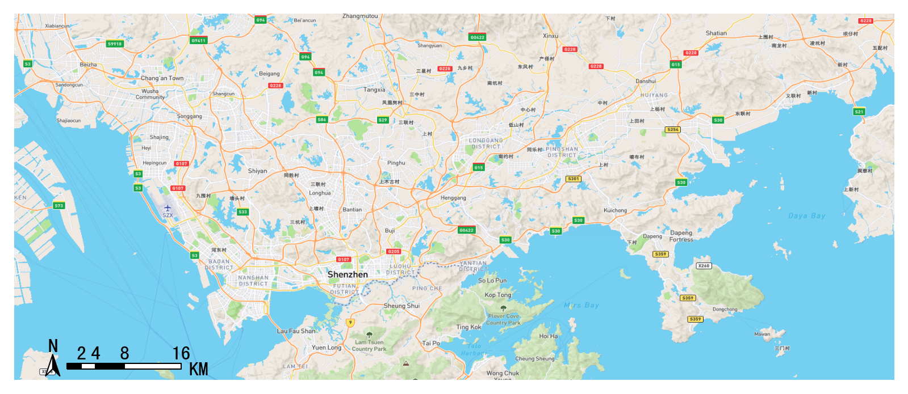

底图样式2：outdoors
----------------------------------------

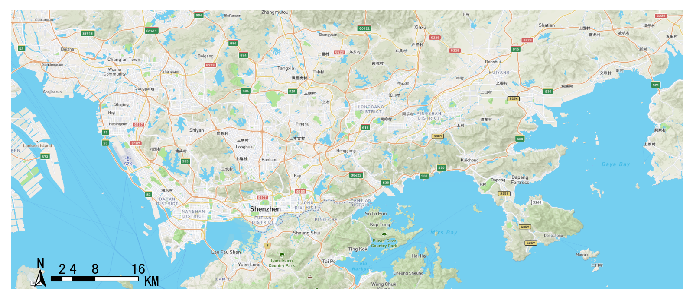

底图样式3：satellite
----------------------------------------

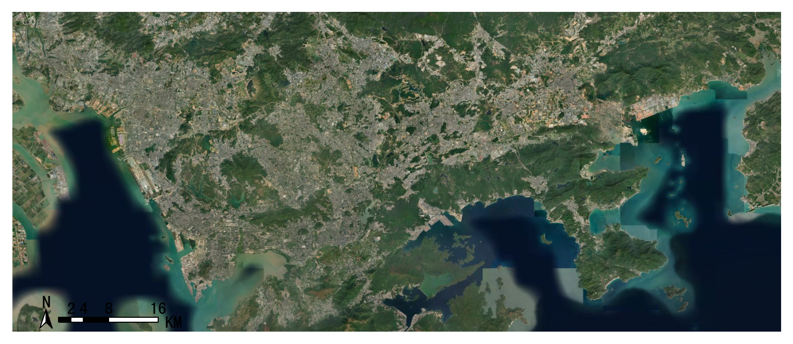

底图样式4：light
----------------------------------------

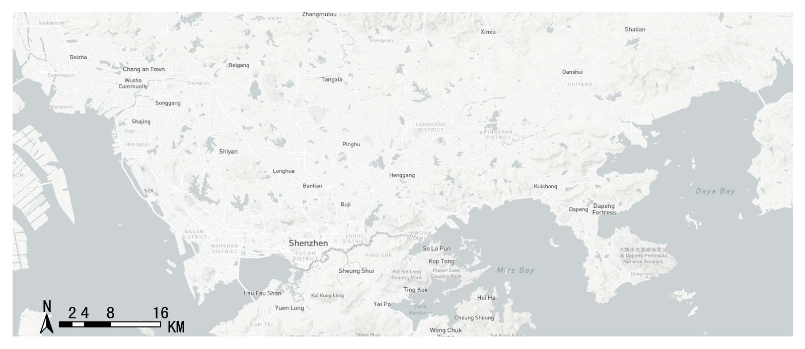

底图样式5：dark
----------------------------------------

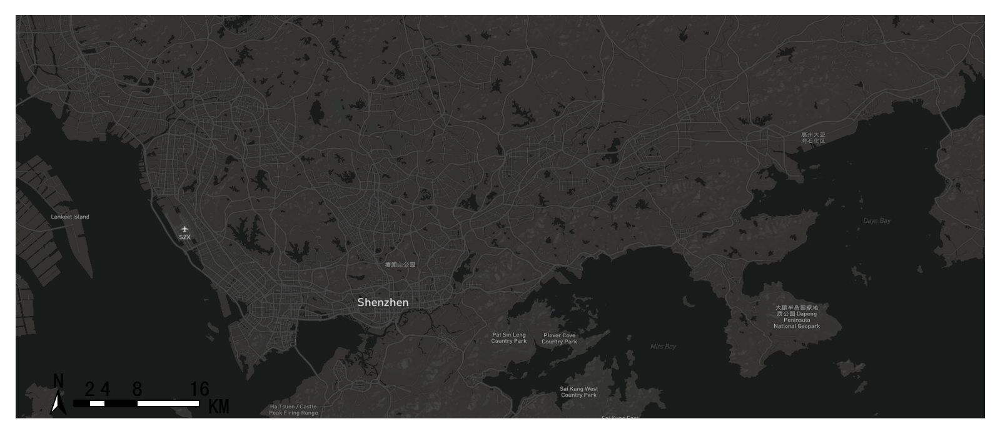

底图样式6：light-ch（中文）
----------------------------------------

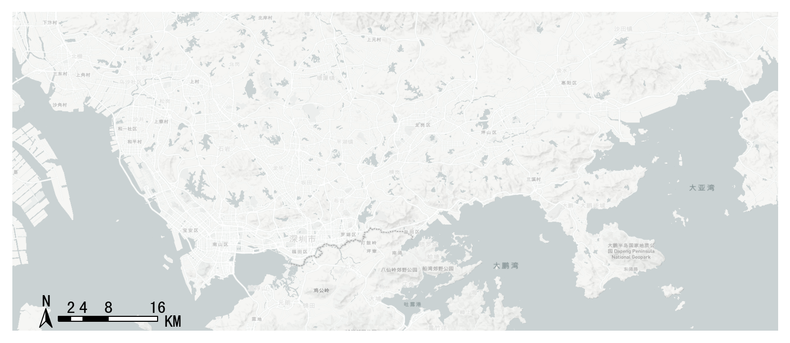

底图样式7：ice creem
----------------------------------------

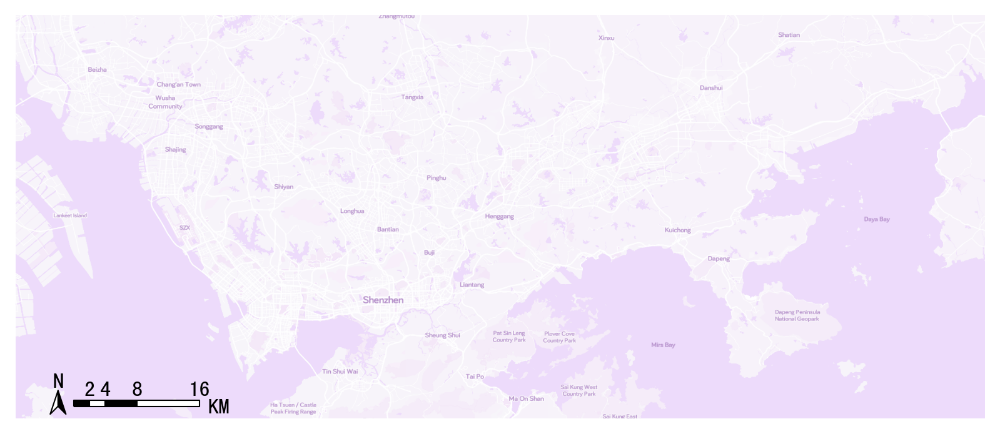

底图样式8：night
----------------------------------------

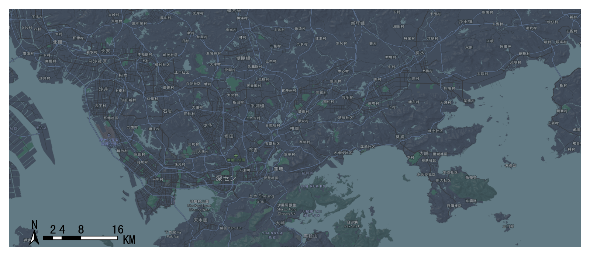

底图样式9：terrain
----------------------------------------

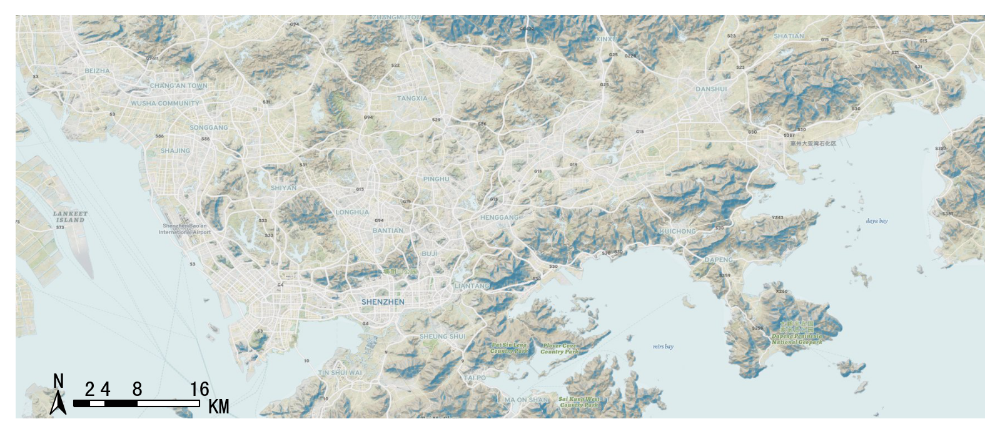

底图样式10：basic blue
----------------------------------------

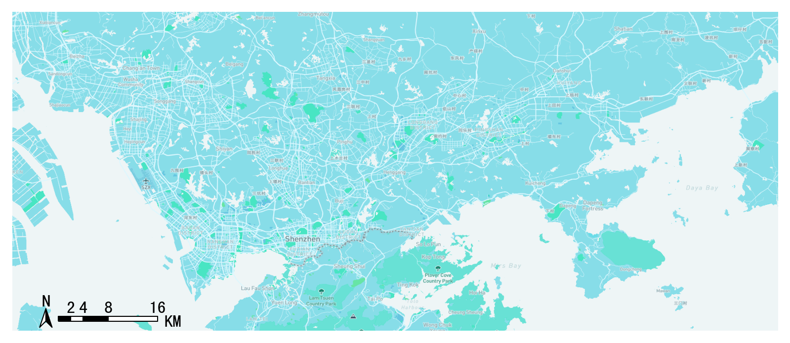

底图样式11：light(无标注)
----------------------------------------

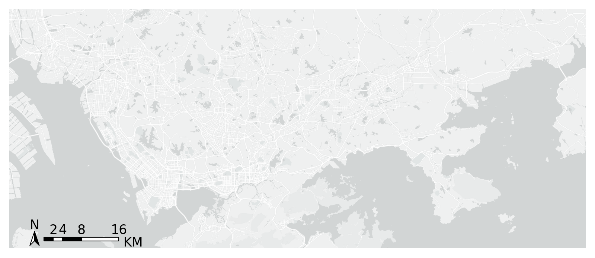

底图样式12：dark(无标注)
----------------------------------------

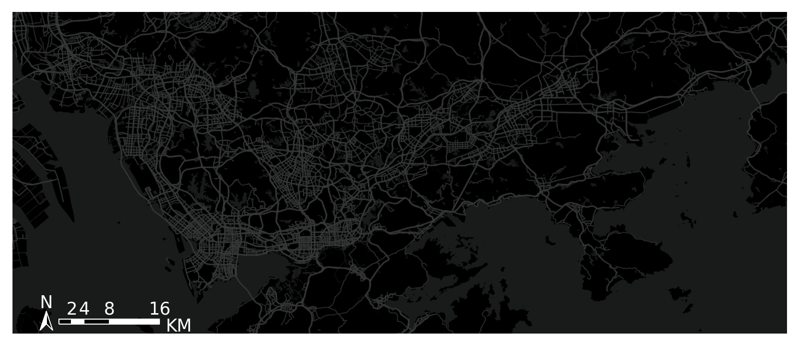

自定义样式：0.4.8以上版本支持
----------------------------------------

需要传入mapbox的样式代码：

::

    tbd.plot_map(plt,bounds,zoom = 11,style = 'mapbox://styles/ni1o1/cl38pljx0006r14qp7ioy7gcc')

用法
----------------------------------------

::

    #设定显示范围
    bounds = [lon1,lat1,lon2,lat2]  
    tbd.plot_map(plt,bounds,zoom = 12,style = 4)  

指北针和比例尺
=============================

.. autofunction:: plotscale

::

    tbd.plotscale(ax,bounds = bounds,textsize = 10,compasssize = 1,accuracy = 2000,rect = [0.06,0.03])  
